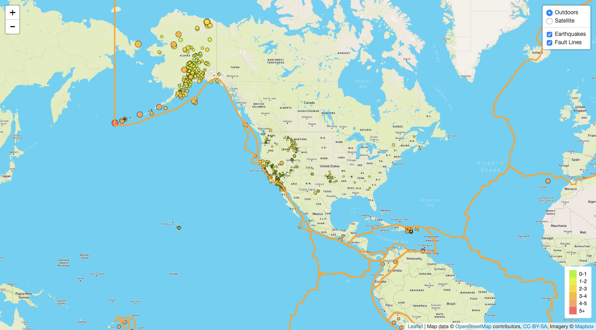
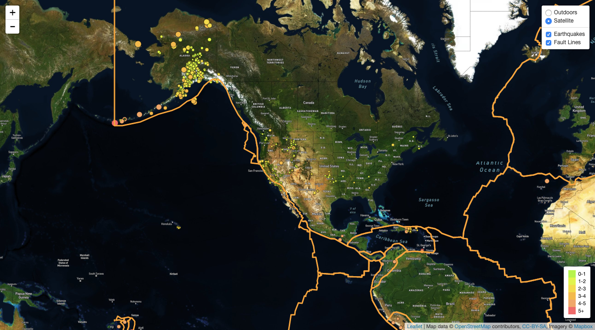

# leaflet-challenge
In the folder [leaflet-step-2](leaflet-step-2/), I created a multi-layer map of earthquake data using [**Leaflet.js**](https://leafletjs.com/) and [**D3.js**](https://d3js.org/). The base maps are from [MapBox API](https://www.mapbox.com/); the overlay maps are from  
[USGS's earthquake feed](http://earthquake.usgs.gov/earthquakes/feed/v1.0/geojson.php) and [Fraxen's tectonic plates](https://github.com/fraxen/tectonicplates). The map includes layer controls, custom markers, a legend attached to the earthquakes layer, and popups with earthquake locations and magnitudes.

### Screenshots:
(To view this content, clone this repo and replace the MapBox API key in [config.js](leaflet-challenge/blob/master/leaflet-step-2/static/js/config.js) with your API key.)

